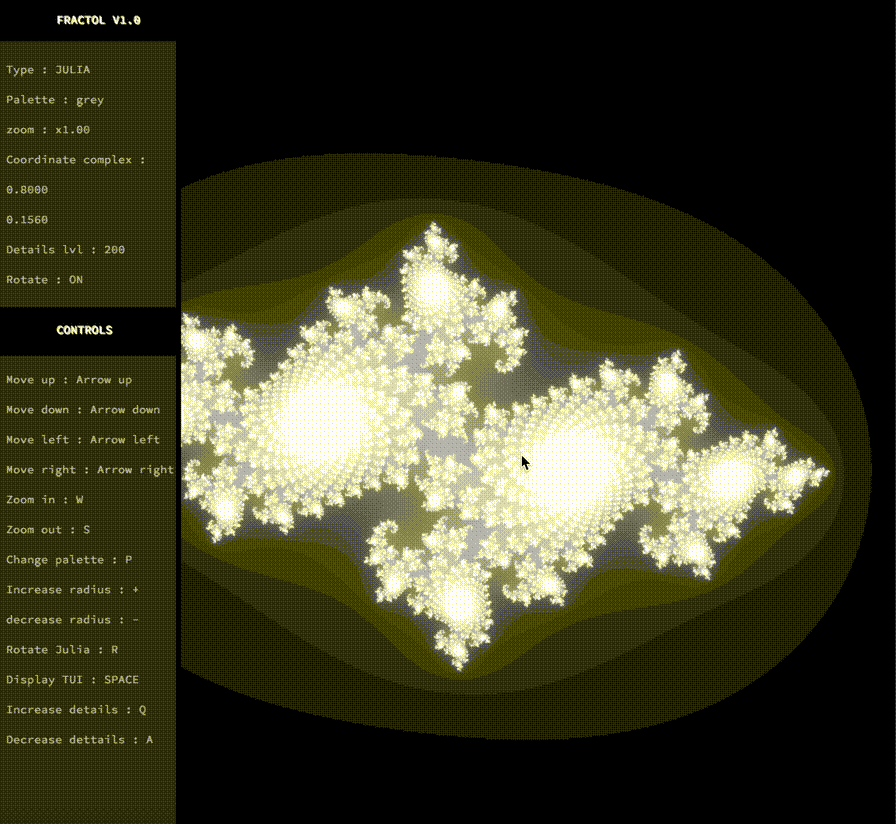
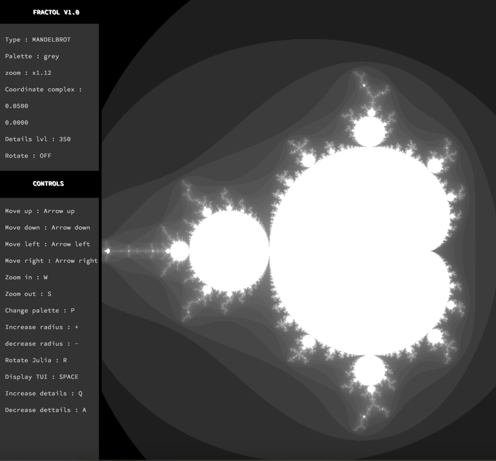
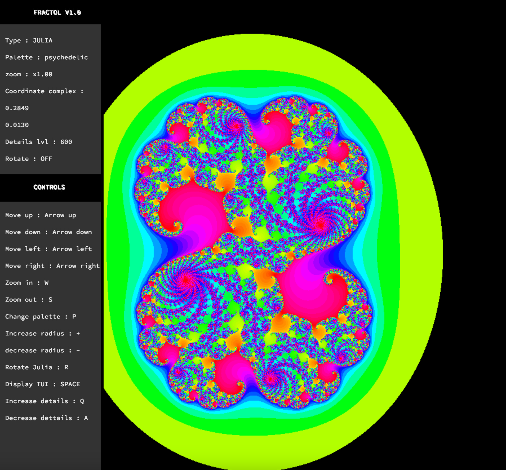
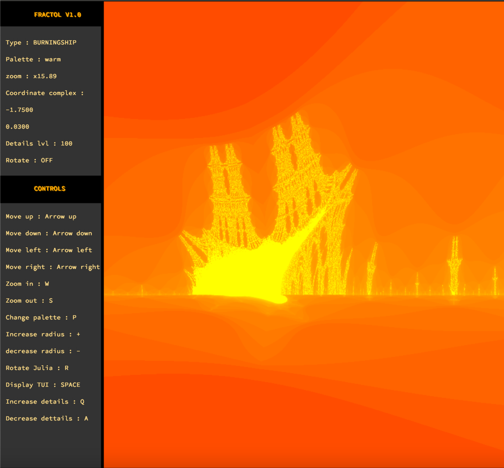
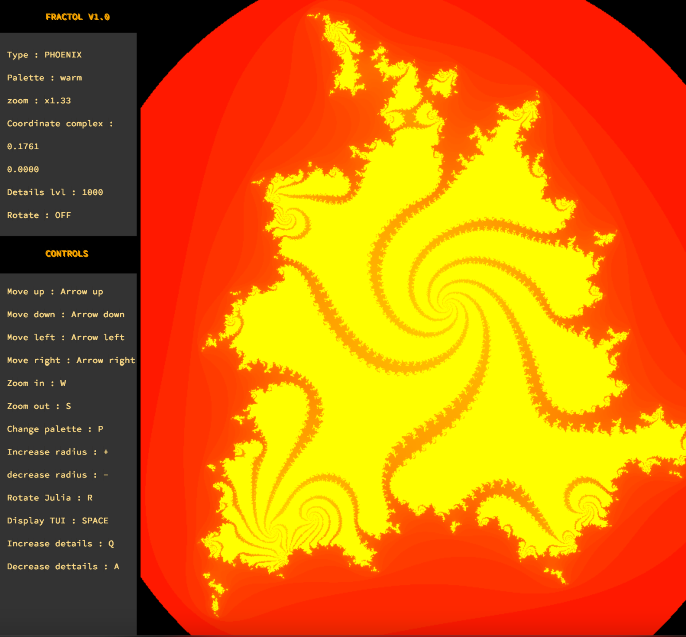
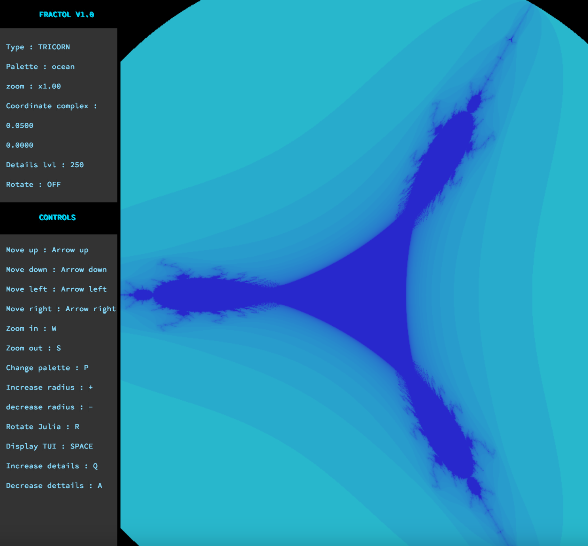

# 🎨 Fract-ol

  

Un explorateur de fractales avancé et performant écrit en C. Ce projet va au-delà du sujet basique en proposant 5 types de fractales, une gestion des couleurs logarithmique HSV et une interface graphique (HUD) pour une expérience utilisateur fluide.



## 📑 Table des Matières
- [Aperçu](#-aperçu)
- [Fonctionnalités Clés](#-fonctionnalités-clés)
- [Liste des Fractales](#-liste-des-fractales)
- [Installation](#-installation)
- [Utilisation & Contrôles](#-utilisation--contrôles)

## 🔭 Aperçu
L'objectif de Fract-ol est de créer un logiciel de rendu graphique capable de générer des fractales en temps réel. Le défi technique réside dans l'optimisation des calculs complexes et la gestion précise des événements via la **MiniLibX**.

## ✨ Fonctionnalités Clés
- **🎨 Rendu HSV Logarithmique** : Utilisation de l'espace colorimétrique Teinte-Saturation-Valeur avec une échelle logarithmique pour des dégradés lisses et profonds, évitant l'effet "banding".
- **🖥️ Interface Graphique (HUD)** : Affichage des informations et contrôles directement à l'écran.
- **🔄 Changement de Palette** : Modification dynamique des couleurs en temps réel via la touche `P`.
- **🔍 Zoom Infini** : Navigation fluide vers l'infiniment petit, centrée sur la position de la souris.

## 🌀 Liste des Fractales
Ce projet supporte 5 fractales distinctes :

<div align="center">

### 1. Mandelbrot
*L'ensemble classique et ses motifs infinis.*



<br>

### 2. Julia
*Dynamique et changeante selon les paramètres d'entrée.*



<br>

### 3. Burning Ship
*Une variante asymétrique ressemblant à un navire en feu.*



<br>

### 4. Phoenix
*Une fractale aux motifs plus courbés et organiques.*



<br>

### 5. Tricorn
*Aussi appelée "Mandelbar", une variation géométrique de Mandelbrot.*



</div>

## 🚀 Installation

### Prérequis
* Un système UNIX (Linux/MacOS).
* `gcc` et `make`.
* Les librairies X11 (généralement préinstallées ou disponibles via le gestionnaire de paquets).

### Compilation
Cloner le dépôt et compiler avec les bonus :

```bash
git clone [https://github.com/Lutch69/Fract-ol.git](https://github.com/Lutch69/Fract-ol.git)
cd Fract-ol
make bonus
